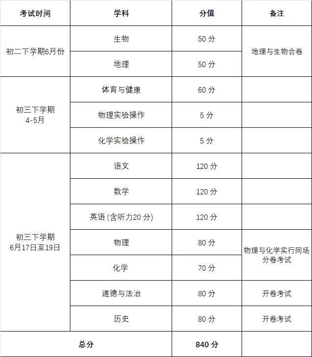
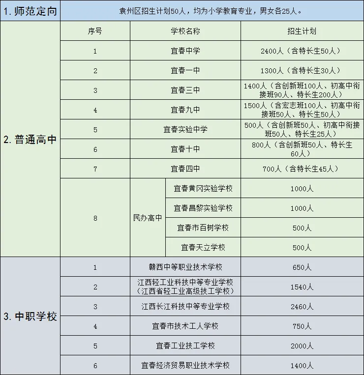

# 2023年宜春市及中心城区招生政策解读

 23年中考细则 

 各科详情 

 志愿填报及录取 

（1）网上填报志愿的时间安排在6月12-15日。

（2）师范定向生的录取最低控制分数线不得低于当地初中学考计分科目总分的70%。特长生文化成绩录取最低控制线按招生学校统招分数线的70%划定。

（3）均衡生录取最低控制分数线，由各县市根据本地招生实际情况，参照往年录取数据划定，一次未完成的均衡生招生计划，以县（市、区）为单位按考生均衡志愿从高分到低分择优录取。

（4）普通高中招生实行限时报到制，各地招考部门需及时公布各批次普通高中的报到期限。对已录取未按时报到的考生，视为自动放弃录取资格，该类考生可参加下一批次普通高中录取。

 与往年不同之处* 

1.返乡就读高中的政策有变化。省厅文件要求：回户籍所在地参加录取的考生，必须是以家庭为单位的居民户籍，且3年内未办理户籍迁移手续。

2.对残疾考生关爱有新举措。残疾考生在考试过程中需要提供“合理便利”服务的，相应办法参照高考执行。

3.体育考试项目有调整。今年考试项目由去年的3项调整为2项，不设置必考项目，将原必考项目（男子 1000 米/女子 800 米）调整为选考项目。由考生从考试8个项目中选择 2 项进行考试，分值调整为每项各30 分，共计60分。

 高中阶段学校招生办法 

 招生学校和招生计划 

 志愿设置及填报办法 

中心城区高中阶段学校招生录取分7个批次,实行考前填报志愿，考生可以根据自己的意愿填报符合报考条件的各批次志愿。

1.提前批次：设师范定向1个选项。凡户籍在袁州区且志愿从事乡村教育事业的应届初中毕业生可以填报此志愿。

2.第一批次：设“宜春中学和宜春一中”、宜春九中宏志班、宜春三中创新班、宜春实验中学创新班、宜春十中创新班等5个选项。考生从5个选项中填报1个。应届初中毕业生方可填报该志愿，历届生不得填报该志愿。

3.第二批次：设宜春中学、宜春一中、宜春三中、宜春九中、宜春实验中学、宜春十中等6所学校的特长生志愿选项。考生可以从6个选项中填报1个。

4.第三批次：为平行志愿，设宜春三中、宜春九中、宜春实验中学、宜春十中4个选项。考生可填报4个志愿。

5.第四批次：设宜春四中1个选项。

6.第五批次：为民办高中志愿，设宜春黄冈实验学校、宜春昌黎实验学校、宜春市百树学校、宜春天立学校等4个选项。考生从4个选项中填报1个。

7.第六批次：为中职学校、技工学校志愿，设赣西中等职业技术学校、江西轻工业科技中等专业学校（江西省轻工业高级技工学校）、江西长江科技中等专业学校、宜春市技术工人学校、宜春工业技工学校、宜春经济贸易职业技术学校6个选项。考生从6个选项中填报1个。

 录取办法 

高中阶段学校招生坚持“尊重志愿、公开透明、择优录取”的原则进行录取。

按照提前批次、第一批次、第二批次、第三批次、第四批次、第五批次、第六批次的顺序分批次依次录取，并实行限时报到制。

各批次录取前，按照招生计划、考生志愿和初中学考成绩划定各批次投档线。特别注意的是，“宜春中学和宜春一中”均衡控制线，在其统招分数线的基础上，下降65分划定。初中学校及时告知考生预录取结果（报名平台可以查询预录取结果），预录取考生持准考证在规定的时间内到所录学校现场确认。对未按时现场确认的考生，视为自动放弃预录取资格。

 招录工作日程安排 

| 序号 | 日期       | 内容                         |
| ---- | ---------- | ---------------------------- |
| 1    | 7月2日     | 公布初中学考成绩             |
| 2    | 7月5-8日   | 提前批次录取                 |
| 3    | 7月9-12日  | 第一批次录取                 |
| 4    | 7月13-14日 | 第二批次录取                 |
| 5    | 7月15-18日 | 第三批次录取                 |
| 6    | 7月19-21日 | 第四批次录取                 |
| 7    | 7月22日起  | 第五、第六批次录取           |
| 8    | 8月初      | 五年制高职和普通中专志愿填报 |