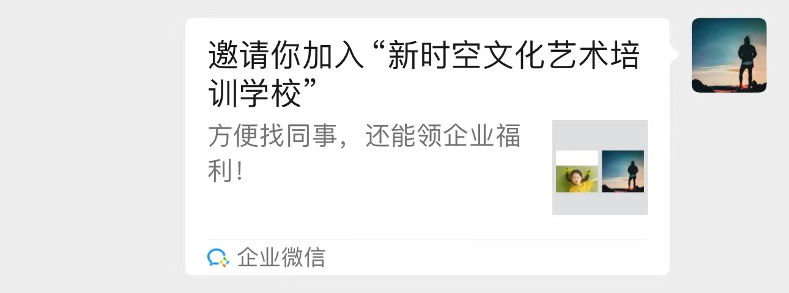
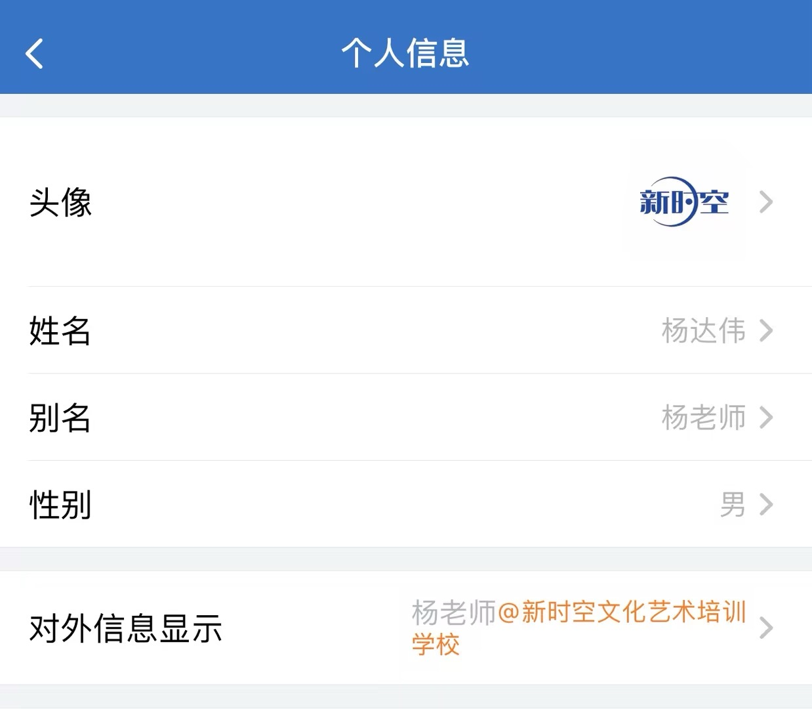

# 入职流程

### 一、加微信好友

通过笔试面试后首先添加学校管理人员微信，识别二维码申请好友，备注好姓名

### 二、企业微信

学校使用企业微信与家长进行联络，新老师请按以下流程申请并使用企业微信

1. 教学主管会通过微信发`企业微信邀请链接`，填写信息并确认加入
   

2. App Store或者应用商店下载`企业微信app`

   

3. 登陆企业微信：使用微信跳转登陆，不需要额外注册企业微信账号

4. 点击主界面 --> 我 --> 个人信息，将【对外信息显示】修改为某老师，不要显示全名
   

5. 查看工作群和学生群的历史聊天记录，了解学校动态，学习老教师是如何在群内和家长沟通的

> 企业微信可以查看进群前的聊天记录

### 三、领取纸质教学资料

1. 《教材全解》：数学、物理、化学、英语老师推荐使用
2. 《新观察》：数学老师推荐使用
4. 《星火英语》：英语老师推荐使用
4. and so on

### 四、收藏学校官网

网址：https://xinshikong.org

官网主要功能

- 进入学科网
- 下载电子书
- 观看在线网课

### 五、学习学科网的使用

网址：https://www.zxxk.com

> 学科网的移动端基本无法使用，和电脑端差别非常大，所以请大家尽量使用电脑或平板访问，不要用手机访问（包括手机app，也基本没法使用）

学科网资料私发给杨老师进行下载，如下图

### 六、学习电脑和打印机的使用